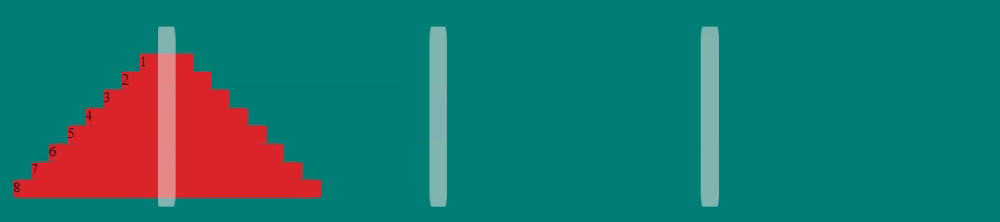

# Hanoi Tower
# 

## Description 
The Tower of Hanoi was a famous problem posed by a mathematician in 1883,
The "puzzle" is to move all the disks from the left hand post to the right hand post, only moving the disks one at a time and a bigger disk can never be placed on a smaller disk.

Originally, the example had five disks. The exercise was to change it to be a non-fixed disk limit by adding an input control.

---------

## How to Run 
- Open the .html file in a browser (Chrome, Edge, Safari, Firefox)
- Change the # of disks you want to solve (Min: 2 / Max: 10)
- Click the 'Load Disks' button - this will add the disks to the 1st peg
- You can either Manually move through the moving of the disks by clicking the 'Make Move' button, or have the browser complete all the moves for you by clicking the 'Auto Run' button
- When all moves are complete a popup message telling you that the 'Tower is Finished' along with how many moves it took to complete

---------

## Improvements Made
- 2022-02-05: Added ability to make # of disks specified by user
- 2022-02-05: Added ability to load the 1st peg with the number of disks selected/entered
- 2022-02-05: Added ability to auto run through the movement of the disks from start to end
- 2022-02-05: Added the total movements to the popup message
- 2022-02-05: Added ability to clear the disks and start over
- 2022-02-05: Added check for # of disks: >2 *1 is pointless / <10 *your machine if older will thank me
- 2022-02-05: Enabling/Disabling buttons based on what should be allowed

---------

## Roadmap of future improvements
- Space out the pegs further, after 8 disks, the disks blend together when disk 9 & 8 are in side by side pegs
- Randomize the color of disks to give a better visualization of what disk is being moved

---------

## Files 
- **/images/HanoiTower.jpg** - Used in the Readme file 
- **index.html** - Start-up file to be opened by browse 
- **styles.css** - Stylesheet file that positions objects, controls text, colors, and layout
- **tower.js** - Javascript file manipulating what is occuring in the browser 
- **hanoi.js** - Javascript file that builds the pegs and disks

---------

## Purpose 

This was done as an assignment in the MIT course - Full Stack Development with Mern

---------

The MIT License (MIT)
=====================

Copyright © 2022 slumpbuster

Permission is hereby granted, free of charge, to any person
obtaining a copy of this software and associated documentation
files (the “Software”), to deal in the Software without
restriction, including without limitation the rights to use,
copy, modify, merge, publish, distribute, sublicense, and/or sell
copies of the Software, and to permit persons to whom the
Software is furnished to do so, subject to the following
conditions:

The above copyright notice and this permission notice shall be
included in all copies or substantial portions of the Software.

THE SOFTWARE IS PROVIDED “AS IS”, WITHOUT WARRANTY OF ANY KIND,
EXPRESS OR IMPLIED, INCLUDING BUT NOT LIMITED TO THE WARRANTIES
OF MERCHANTABILITY, FITNESS FOR A PARTICULAR PURPOSE AND
NONINFRINGEMENT. IN NO EVENT SHALL THE AUTHORS OR COPYRIGHT
HOLDERS BE LIABLE FOR ANY CLAIM, DAMAGES OR OTHER LIABILITY,
WHETHER IN AN ACTION OF CONTRACT, TORT OR OTHERWISE, ARISING
FROM, OUT OF OR IN CONNECTION WITH THE SOFTWARE OR THE USE OR
OTHER DEALINGS IN THE SOFTWARE.
